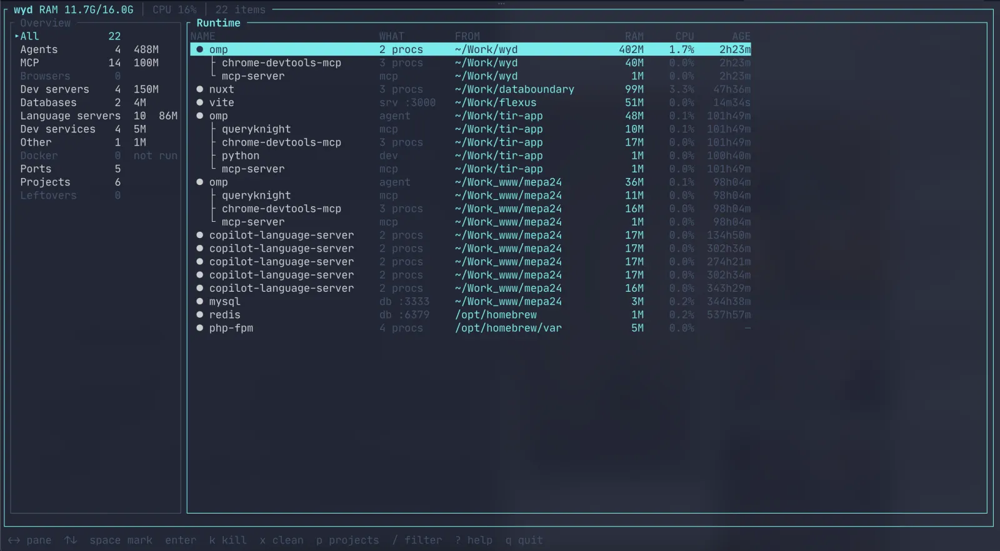

# wyd

**What the hell is still running?**

AI agents, MCP servers, headless Chromium, Vite, and last week's Docker leftovers pile up on a developer machine. `ps` and `docker ps` show every PID. wyd shows the *session*: who started it, which project, whether it's leftover, and whether you can kill it.

Local TUI. macOS and Linux. No account, no network, no telemetry.

```bash
cargo install wyd
wyd
```

Binaries: [GitHub Releases](https://github.com/oxyplay/wyd/releases). From a clone: `cargo install --path .`



OS daemons stay hidden. Desktop Chrome stays hidden. Agent-spawned Chromium does not.

## Why wyd

| | `ps` / Activity Monitor | Docker Desktop | wyd |
|---|---|---|---|
| Every process | yes | containers only | only dev runtime |
| Who started it | no | compose labels | agent → MCP → browser |
| Which project | no | sometimes | cwd / git root |
| Leftover? | no | you guess | scored, with a reason |
| Safe kill | you hope | stop/rm | PID + start time, `y` to confirm |
| Volumes | — | easy to nuke | unused ≠ garbage; `D` required |

Built for people who run coding agents all day and then ask *what did that session leave behind?*

## Keys

| Key | Action |
|---|---|
| `←` `→` | overview / list |
| `↑` `↓` | move |
| `enter` | details popup; on a project, pin that project |
| `space` | mark several |
| `k` / `K` | terminate / force kill (`y` confirms) |
| `x` | Docker clean (`y`; volumes need `D`) |
| `p` | projects |
| `/` | filter |
| `r` | refresh |
| `?` | help |
| `esc` | close popup, then clear filter / project, then quit |
| `q` | quit |

Kill only signals the item’s own PIDs (re-checked by PID + start time). An unused Docker volume is never treated as garbage.

## Scripts

Same snapshot as the TUI — useful after an agent finishes a task:

```bash
wyd --json leftovers
wyd --plain mcp
wyd --json project myapp
```

Filters: `leftovers`, `mcp`, `agents`, `docker`, `project`.

```json
{
  "runtime": [{ "type": "mcp", "name": "chrome-devtools-mcp", "pid": 94148, "status": "leftover", "reasons": ["owning agent missing"] }],
  "docker": [{ "type": "dangling-image", "name": "abcdef012345", "status": "dangling", "size_bytes": 1400000000 }]
}
```

Field names stay stable until a major version bump. Empty `ports` / `reasons` / `children` / `project` are omitted.

## Config

`~/.config/wyd/config.toml` — missing file is fine.

```toml
[leftovers]
server_age_hours = 8

[persistent]
commands = ["postgres", "redis-server"]

[projects]
roots = ["~/Work"]

[keys]
quit = "q"
kill = "k"
force_kill = "K"
clean = "x"
help = "?"
refresh = "r"

[[signature]]
category = "agent"
names = ["myagent"]
contains = ["my-company-agent"]
display = "myagent"
```

## License

Apache-2.0. Copyright 2026 Maksym Nevinchanyy.
